# ssg.py

<p align="center">
  
</p>

A static site generator that does what it needs to and stops there. No roadmap,
no grand ambitions. The name is the honest answer to "when will it be finished?"

It builds your blog. That's mostly it.

> *はんま (hanma)* — something half-done, incomplete, not quite a whole unit.

## Features

- Converts `.md` / `.markdown` files to `.html` — written to `./output/` by default, or into
  a separate output directory with `--output`
- Recurses into sub-directories automatically, mirroring the source tree
- Defaults to `./site/` as the content root (falls back to current directory)
- `index.md` becomes the homepage — labelled **Home** and pinned first in the nav
- Folder-based navigation bar — "Home" pinned first; pages grouped by directory with dropdown menus; posts listing link ("Blog" by default) always last
- Responsive layout — 80% width centred, collapses cleanly on mobile
- Dark mode with OS preference detection and manual toggle (persisted via `localStorage`)
- Syntax-highlighted fenced code blocks (Pygments — themed per light/dark mode)
- Tables, footnotes, definition lists, abbreviations, blockquotes, linked images
- `Last updated` timestamp auto-generated from the file's modification time
- Built-in HTTP server (`--serve`) for local preview with correct theme persistence
- `--watch` mode — uses `watchdog` (inotify/FSEvents) for near-instant rebuilds; falls back to 1-second polling if not installed
- Stale output cleanup — HTML files with no corresponding source are removed automatically on every generation and in `--watch` mode when source files are deleted
- YAML front matter — optional `---` block at the top of any `.md` file for per-page metadata
- Theme system — swap the entire HTML/CSS/JS layout with `--theme NAME`; themes are self-contained directories
- Site config file (`ssg.yml`) — project-level defaults for name, output, theme, base URL, and more
- Tag index pages — `tags/<slug>.html` generated automatically from front matter tags
- Layout system — `layout: post` or `layout: page` front matter (files in `posts/` default to `post`; all others default to `page`); `posts/index.html` listing auto-generated from all `layout: post` pages sorted by file modification time (newest first), accessible at `/posts/`
- Client-side search — `search.json` generated and searchable inline via the default theme's header search box
- Sitemap — `sitemap.xml` generated when `--base-url` is set
- Static asset passthrough — `site/static/` copied verbatim to the output directory
- Incremental builds (`--incremental`) — only regenerates pages whose source, theme template, or config file has changed
- `--init` scaffold — creates a sample `site/` directory with starter content
- Skips dot-directories (e.g. `.venv`, `.git`) and `README.md` files automatically

## Requirements

Python 3.10+ and the following packages:

### Setting up a virtual environment

It is recommended to install dependencies into a virtual environment rather
than your system Python:

```bash
# Create the virtual environment (once)
python -m venv .venv

# Activate it
source .venv/bin/activate        # Linux / macOS
.venv\Scripts\activate           # Windows

# Install dependencies
pip install markdown pygments pymdown-extensions pyyaml watchdog

# When you are done
deactivate
```

The virtual environment directory (`.venv`) is automatically skipped by
`ssg.py` during Markdown discovery.

## Setup

Make the script executable so you can run it directly without typing `python`:

```bash
chmod +x ssg.py
```

The script already contains the appropriate shebang line (`#!/usr/bin/env python3`),
so after `chmod +x` you can invoke it as:

```bash
./ssg.py
./ssg.py --name "My Blog" --serve
```

## Project layout

The recommended structure places all Markdown content under `site/`:

```
project/
├── ssg.py
├── conf/
│   └── ssg.yml         ← site config (optional)
└── site/
    ├── index.md        ← homepage (labelled "Home" in navigation)
    ├── about.md
    ├── static/         ← copied verbatim to output/static/
    │   └── logo.png
    └── posts/
        └── hello.md
```

Running `./ssg.py` from the project root will automatically discover and
process everything under `site/`, including sub-directories.

### Separate output directory

Use `--output` to write all generated HTML into a separate directory, keeping
source files untouched. The source tree is mirrored exactly:

```
project/
├── ssg.py
├── site/
│   ├── index.md
│   ├── about.md
│   └── posts/
│       └── hello.md
└── dist/               ← created by --output dist/
    ├── index.html
    ├── about.html
    └── posts/
        └── hello.html
```

## Usage

```bash
# Convert ./site/ (default)
./ssg.py

# Write output to a separate directory
./ssg.py --output dist/

# Generate and serve locally (recommended for development)
./ssg.py --name "My Blog" --serve

# Generate into dist/ and serve from there
./ssg.py --output dist/ --name "My Blog" --serve

# Serve on a custom port (two equivalent forms)
./ssg.py --serve 9000
./ssg.py --serve --port 9000

# Convert a single file
./ssg.py site/post.md

# Target a specific directory explicitly
./ssg.py ~/my-blog

# Use a custom theme
./ssg.py site/ --output output/ --theme mytheme

# Watch for changes and regenerate automatically
./ssg.py site/ --output output/ --watch

# Watch and serve simultaneously
./ssg.py site/ --output output/ --watch --serve

# Only rebuild pages that changed since last build
./ssg.py --incremental

# Generate sitemap.xml and absolute URLs in search.json
./ssg.py --base-url https://example.com

# Use a config file explicitly
./ssg.py --config path/to/ssg.yml

# Preview what would be converted without writing anything
./ssg.py --dry-run

# Scaffold a new site with sample content in ./site/
./ssg.py --init

# Scaffold into ./site/ even if it already contains files (wipes it first)
./ssg.py --init --force

# List available themes
./ssg.py --list-themes

# Show version
./ssg.py --version
```

> **Note:** The `--serve` flag is recommended for local development. Browsers
> restrict `localStorage` access when opening HTML files directly via
> `file://`, which prevents the theme preference from persisting across pages.
> Serving over `http://localhost` resolves this. When `index.html` is present,
> `--serve` will open it automatically as the landing page.

## Options

| Flag | Default | Description |
|---|---|---|
| `path` | `./site/` | Markdown file or directory to convert |
| `--name NAME` | `Blog` | Site name displayed in the page header |
| `--output DIR` | `./output/` | Directory to write generated HTML files |
| `--base-url URL` | — | Absolute base URL; enables `sitemap.xml` and absolute URLs in `search.json` |
| `--config FILE` | `conf/ssg.yml` | Path to a config file; overrides default lookup order |
| `--theme NAME` | `default` | Theme to use from the `themes/` directory |
| `--dry-run` | — | List matched files without writing HTML |
| `--incremental` | — | Only rebuild pages whose source has changed since the last build |
| `--serve [PORT]` | — | Start a local HTTP server after generating; optional inline port |
| `--port PORT` | `8000` | Port for the local HTTP server (alternative to `--serve PORT`) |
| `--watch` | — | Watch source files and regenerate on changes after initial build |
| `--init` | — | Scaffold a new `site/` directory with sample content |
| `--force` | — | Used with `--init`; wipes `site/` before scaffolding |
| `--list-themes` | — | List available themes and exit |
| `--version` | — | Print version and exit |

## Site Config File

A `conf/ssg.yml` file (next to `ssg.py`) sets project-level defaults. CLI flags always override config file values.

```yaml
name: My Site           # site name shown in header
base_url: https://...   # used for sitemap.xml and absolute URLs in search.json
output: dist/           # output directory
theme: default          # theme name
serve: false            # start HTTP server after build (true/false)
port: 8000              # HTTP server port
watch: false            # watch for changes and rebuild (true/false)
incremental: false      # only rebuild changed pages (true/false)
posts_label: Blog       # label for the posts listing link in the nav (default: "Blog")
```

Config file lookup order (first found wins):
1. `--config FILE` flag
2. `conf/ssg.yml` (next to `ssg.py`) — the shipped default
3. `ssg.yml` at the root of the source directory
4. `ssg.yaml` at the root of the source directory (legacy fallback)

## Homepage

If `site/index.md` exists it is treated as the homepage:

- Converted to `index.html` (in-place or in `--output` dir)
- Labelled **Home** in the navigation bar regardless of the H1 in the file
- Always pinned as the first navigation item
- Opened automatically in the browser when using `--serve`

## Ignored Files

The following are silently skipped during directory traversal:

- Any file or directory whose name begins with `.` (e.g. `.venv`, `.git`)
- `README.md` and `README.markdown` (case-insensitive) in any directory

## Front Matter

Any `.md` file can include an optional YAML front matter block at the very top,
delimited by `---` lines:

```markdown
---
title: My Post Title
description: A short summary shown in search results.
author: Jane Doe
date: 2025-06-01
tags:
  - python
  - web
draft: false
refresh: 60
---

# Content starts here
```

All fields are optional. When present they take effect as follows:

| Field | Type | Effect |
|---|---|---|
| `title` | string | Overrides the auto-extracted H1 heading; prepended with the site name in the browser title |
| `description` | string | Overrides the auto-extracted first paragraph |
| `author` | string | Shown in the page footer; added as `<meta name="author">` |
| `date` | YYYY-MM-DD | Shown in the page footer alongside the author (has no effect on post listing order or display — posts always sort and display by file modification time) |
| `layout` | string | `page` or `post` — overrides directory-based default (`posts/` files default to `post`) |
| `tags` | list | Rendered as a tag strip below the content; generates `tags/<slug>.html` index pages; added as `<meta name="keywords">` |
| `draft` | bool | If `true`, the page is silently skipped during generation |
| `refresh` | int | Auto-refresh interval in seconds — injects `<meta http-equiv="refresh">` into the page head; omit or set to `0` to disable |

## Generated Pages

Several pages are generated automatically alongside converted Markdown:

| Page | Generated when |
|---|---|
| `tags/<slug>.html` | Any source page has a `tags` front matter field |
| `posts/index.html` | Any source page has `layout: post` (files in `posts/` default to this; skipped if `posts/index.md` exists); sorted by file mtime newest-first; dates displayed as `M/D/YYYY @ HH:MM AM/PM`; served at `/posts/` URL |
| `sitemap.xml` | `--base-url` is set |
| `search.json` | Always — used by the default theme's inline search box |

## Static Assets

A `static/` directory at the root of the source directory is copied verbatim to `output/static/`. Use it for images, fonts, downloads, and any other non-Markdown files:

```
site/
├── index.md
└── static/
    ├── logo.png
    └── fonts/
        └── custom.woff2
```

## Syntax Highlighting

Fenced code blocks are highlighted using [Pygments](https://pygments.org/).
The light mode uses the `friendly` theme and dark mode uses `monokai` —
both switch automatically with the page theme, including OS-level dark mode
preference.

````markdown
```bash
echo "hello world"
```
````

Pygments attempts to auto-detect the language if none is specified. For best
results, always declare the language after the opening fence.

## Themes

The visual layout is controlled by a theme. Themes live in `themes/<name>/`
alongside `ssg.py` and are fully self-contained directories:

```
themes/
└── default/          ← built-in theme
    └── template.html ← HTML/CSS/JS skeleton
```

Additional files in the theme directory (CSS, images, fonts) are copied
to the output root automatically at generation time.

Select a theme with `--theme`:

```bash
./ssg.py site/ --output output/ --theme mytheme
```

List available themes:

```bash
./ssg.py --list-themes
```

### Creating a custom theme

1. Copy `themes/default/` to `themes/mytheme/`
2. Edit `template.html` — it uses Python's `string.Template` `$variable` syntax
3. Add any static assets (CSS, images) alongside `template.html`

Available variables in `template.html`:

| Variable | Content |
|---|---|
| `$title` | Browser title (automatically prepended with site name) |
| `$description` | Page description (meta) |
| `$site_name` | Site name from `--name` or config |
| `$date_str` | Today's date |
| `$nav` | Navigation bar HTML |
| `$content` | Rendered page content |
| `$author_line` | Author/date attribution (empty if not set) |
| `$author_meta` | `<meta name="author">` tag (empty if not set) |
| `$keywords_meta` | `<meta name="keywords">` tag (empty if not set) |
| `$refresh_meta` | `<meta http-equiv="refresh">` tag (empty if `refresh` not set) |
| `$source_file` | Source `.md` filename |
| `$last_updated` | File modification timestamp |
| `$HIGHLIGHT_CSS` | Pygments syntax highlighting CSS |
| `$sitemap_link` | Link to `sitemap.xml` (empty if `--base-url` not set) |
| `$search_json_url` | URL to `search.json` (relative or absolute) |

## Testing

A pytest suite lives in `tests/test_ssg.py` and covers syntax checking, file
discovery, conversion, CLI flags, navigation, and edge cases.

```bash
# Install pytest into your virtual environment (one-time)
pip install pytest

# Run all tests
python -m pytest tests/ -v
```

## Customisation

Visual styling is fully delegated to the active theme. See the **Themes** section above for details on creating or modifying themes under `themes/`.

## License

MIT
