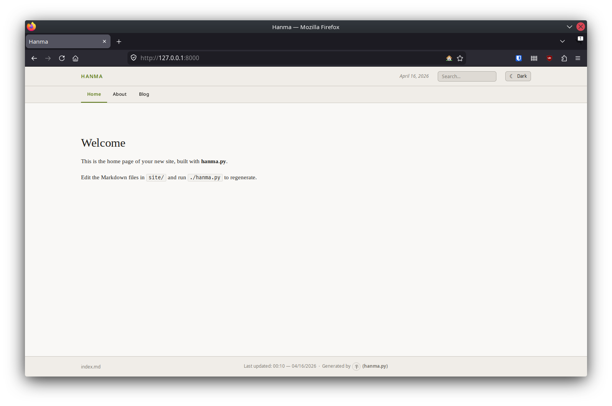
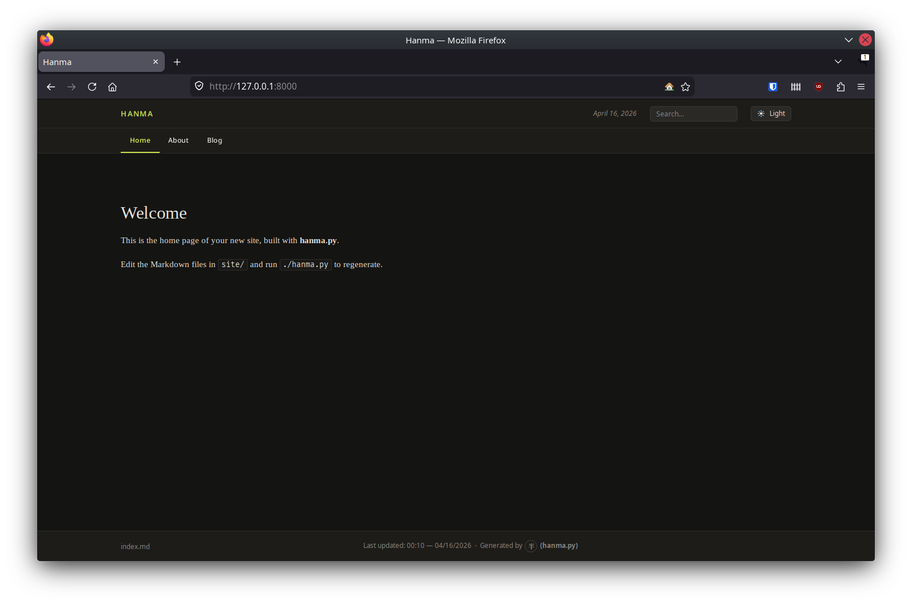
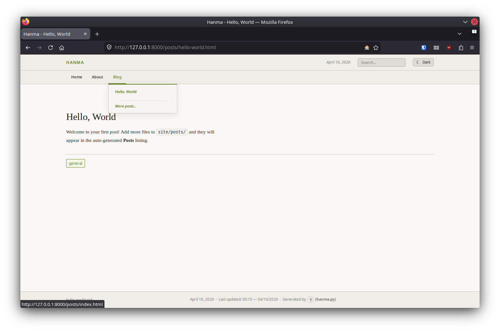
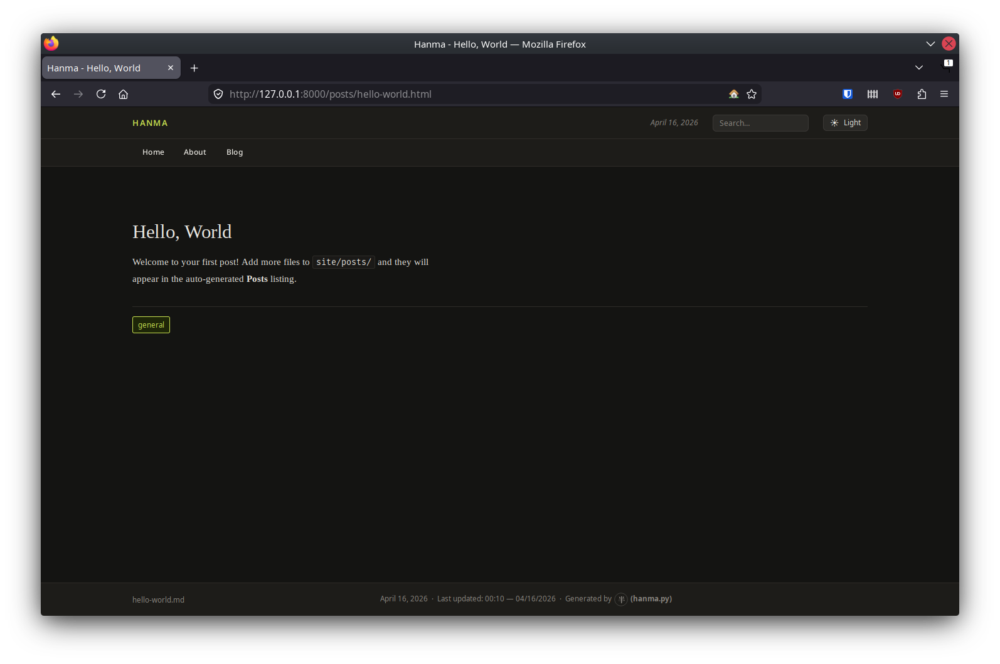

<p align="center">
  
</p>

A static site generator that does what it needs to and stops there. No roadmap,
no grand ambitions. The name is the honest answer to "when will it be finished?"

It builds your blog. That's mostly it.

> *はんま (hanma)* — something half-done, incomplete, not quite a whole unit.

## Key Features

- **Folder-based Nav**: Automatic dropdowns and "Home" pinning based on your directory structure.
- **Modern Defaults**: Dark mode, responsive layout, and client-side search built-in.
- **Developer First**: Hot-reloading `--watch` mode, incremental builds, and a built-in `--serve` command.
- **Fully Extensible**: Self-contained theme system and flexible YAML front matter.
- **Production Ready**: Syntax highlighting (Pygments), sitemaps, and optional HTML sanitization.

## Screenshots

<p align="center">
  
  
</p>
<p align="center">
  
  
</p>

## Quick Start

### 1. Requirements & Setup

Hanma requires Python 3.10+. Install the core dependencies (including optional sanitization support) into a virtual environment:

```bash
python -m venv .venv
source .venv/bin/activate  # Linux/macOS
pip install markdown pygments pyyaml jinja2 watchdog bleach tinycss2 html5lib
```

## Setup

Make the script executable so you can run it directly without typing `python`:

```bash
chmod +x hanma.py
```

### 2. Scaffold & Build

Create a new site and start the development server in one go:

```bash
./hanma.py --init
./hanma.py --watch --serve
```

Your site is now available at `http://localhost:8000`.

## Project Layout

```
project/
├── hanma.py      ← CLI entry point
├── app/          ← Generator logic
├── themes/       ← Templates & Assets
├── conf/         ← Site config (optional)
└── site/         ← Your Markdown content
    ├── index.md  ← Homepage
    └── posts/    ← Blog posts
```

## Documentation

For detailed technical guides, see the `docs/` folder:

- [**CLI Usage & Options**](docs/cli_options.md) — Exhaustive list of commands and flags.
- [**Configuration**](docs/configuration.md) — Using `hanma.yml` for project-level defaults.
- [**Front Matter & Metadata**](docs/front_matter.md) — Controlling per-page behavior.
- [**Themes & Customization**](docs/themes.md) — Building your own layout and styles.
- [**Containerization**](docs/containerization.md) — Running Hanma with Podman or Docker.

## Testing

Run the full suite with pytest:

```bash
pip install pytest
python -m pytest tests/ -v
```

## License

GPLv2 — see [LICENSE](LICENSE) for the full text.
